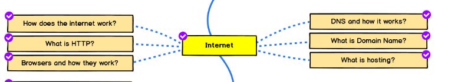
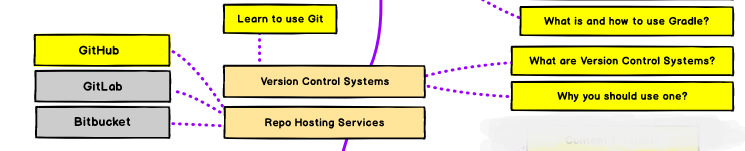

# Software Engineering,SUST!

We are studying Software Engineering or Related subjects but most of us don't know what we are studying or don't have a guideline or don't know how vast the Software Engineering or IT sector is or We just don't know which path we should choose. **Forget choosing path , even we don't know what are the options!**
So I have tried to give some informations and introduce with terminologies which are related to Software Engineering and IT and can help to know our options and choose them properly!

It's not a roadmap which you should follow and will make you GOD in IT sector. It will just show you some stuffs that can help you to choose your path! I have just use the terms and basic stuffs so that you can google them :p

**These `X year Y semester` are just for remembering that you can give `Z` months to know these things well though it can vary from person to person and I have just tried to relate these things and time with our Varsity Syllabus and curriculum !**

## First Year First Semester

- ### Basic Understanding and Fundamental Of Computer :

  **1st of all you need to know what is a computer !**

  - How Computer works
  - Hardware & Software
  - CPU & GPU
  - Operating Systems (there are other Operating Systems excluding Windows!)
  - bla bla :3

* ### A Structured Programming Language :

  **Learn one of them.If you know a language well then shifting or learning new languages will be very easy**

  - **C**
  - Python
  - Java
  - C#

    - Basic Understanding of Programming Lanuguage
    - Data Type
    - Variable
    - Operator
    - Loop
    - Array
    - String
    - Function
    - Recursion
    - Pointer
    - bla bla :3

- Make a Cli (**Command Line**) based **Desktop** application or game using: **(use one of them you have learned before)**

  - **C**
  - Java
  - Python

- ### Start Problem Solving in Online Judges like

  - **[Codeforces](https://codeforces.com)**
  - [CodeChef](https://www.codechef.com)
  - [Spoj](https://www.spoj.com)
  - **[UVA](https://uhunt.onlinejudge.org)**
  - [Hackerrank](https://www.hackerrank.com)
  - [Hackerearth](https://www.hackerearth.com])

**You don't need to solve problems in all judges . You have to select one and solve (Don't use URI).There are a lot of online judges you can google them**

## First Year Second Semester

- ### Data Structure And Algorithms

  - STL or similar
  - Linked List
  - Hash tables
  - Searching Algorithms
  - Sorting Algorithms
  - Number Theory
  - Graph Theory

    - BFS
    - DFS
    - BST
    - heap
    - .......

  - bla bla i dn't know much :3

**Also continue problem solving and participate in online or offline programming contests**

- Make a GUI based Desktop application or game using Library:
  - C (graphics.h)
  - **C++ (SFML)**
  - Python (Tkinter)

## Second Year First Semester

- Depp Drive into Competitve Programming (If you like Problem Solving) :
  [There is a pdf you can check](assets/Dhaka-Regional-Raw-Syllabus-Sheet1.pdf)

  #### For more visit [GOOGLE](https://www.google.com/)

* Explore stuffs :

  - Learn about internet
    

    - Basic about Mobile Platforms

      - Mobile Operating Systems
      - How they works and History

    - Linux and Open Source

      - Use A linux based Operating System like Ubuntu.
      - Lean what is linux and how it works
      - Basic Linux Commands
      - What is open source

    - Verson Control System
    - What is git and how it works
    - Learn using git :
      - **Github**
      - gitlab
      - bitbucket

    

- Learn Object Orianted Programming : **(Learn one of them)**
  - C++
  - **Java**
  - Python
  - C sharp

* Basic Desktop Development: (Build a desktop **Game** or App using one of them .If you have learnt java before then use java library)
  - Java library or framework (Swing,Fx,**Libgdx**)
  - Python library (tkinter,Qt)

## Second Year Second Semester

- Basic Mobile Dev: (Build an application)

  - Android :

    - Vanila Java
    - Kotlin

  - IOS : (**You will need a MAC**)
    - Objective C
    - Swift

* Basic Web Development: (Make a website)
  - **Vanilla**
    - HTML (makrup language)
    - CSS (styling)
    - Javascript (front-end script)
    - PHP (backend)
    - MySql (database)

- Basic Security and Info Sec
  - What is Information Security
  - Hacking
  - Computer Networking
  - Web and Android Security
  - bla bla ( i dn't have much knowlegde about that!)

**If you like competitive programming then keep solving and ranking up**

## Now You have known a lot but not everything.But You have a basic knowledge a lot of sectors and probably you can Choose something

### There are a lot of sectors in IT , Here are some of them :

- Stick to Competitive Programming

- Web Development

  - Front-End
  - Back-End

- Mobile Development

  - Android

    - Application
    - Game

  - IOS (**You will need a MAC**)
    - Application
    - Game

- Desktop Development

  - Linux

    - Kernel or OS
    - Application
    - Game **(not so popular)**

  - Windows

    - Softwares
    - Game

  - Mac
    - Softwares
    - Game **(not so popular)**

* Security and Info Sec ( i dn't have much knowlegde about that!)

* Dev-Ops (Don't have much knowledge)

* Linux System Administration

- Firmware and System Engineer | Embabed System Engineering

* Data Science | Machine Learning | AI | Deep Learning | Neural Networking | Computer Vison

- **And many more .....**

#### So You can choose one of them and deep drive into that or can explore more if you want!

## Here are some starting guides :

- ### Mobile Application Development (Android or IOS)

  - Android

    - **Vanilla Java**
    - Kotlin

  - IOS

    - Objective C (**It's not related to C**)
    - **Swift**

  - Cross Platform
    - Flutter
    - **React Native**
    - bla bla

- ### Desktop Application Development :

  - C++
  - Tkinter | QT (Python)
  - **Java Swing or JavaFX**
  - C#

  #### For more visit [GOOGLE](https://www.google.com/)

- ### Web Development

  - **Basic :**

    - HTML
    - CSS
    - Javascript
    - PHP
    - Mysql

  - Frameworks | Libraries :

    - Front-End:

      - **React (javascript)**
      - Angular (javascript)
      - Vue.js (javascript)

    - Back-End :
      - .Net MVC (C#)
      - **Django (Python)**
      - Express.js (javascript)
      - Spring Boot (Java)
      - Laravel (php)
      - CakePHP (php)
      - Ruby on Rails (ruby)
      - Flask (Python)

- Database :

  - Relational:

    - **Mysql**
    - **PostgreSQL**
    - MariaDB

  - No-Relational:
    - **MongoDB**
    - RethinkDB

#### For more visit [Developer Roadmaps](https://roadmap.sh/)

- ### Game Development :

  - Basic level

    - Can build games using librarires like
      - **Opengl**
      - sfml
      - graphics.h
      - libgdx
      - **Tkinter**

  - Advance :

    - Game Engines :
      - Unity (C#)
      - **Unreal Engine (C++)**
      - OpenGL (C++)
      - CryEngine

    #### For more visit [Roadmap to becoming a game developer in 2020](https://github.com/utilForever/game-developer-roadmap) and Ask [GOOGLE](https://www.google.com/)

* ### Data Science :

  **Tradning**

**Note : The are some online judges where they arrange ML competitions such as [Kaggle](https://www.kaggle.com/)**

- ### Computer Security and Information Security
  **Hacking Stuffs :p**

* ### Dev-Ops :

  Check this out [DevOps Roadmap](https://roadmap.sh/devops) and Google Everything

* ### Linux System Administration :

- ### Firmware and System Engineer :

**Note : I am not a Expert or GOD in IT sector. Just a normal geek exploring things, stuffs and want to help people who have been suffering like me ! Feel fee to contribute to enrich our knowledge.**
