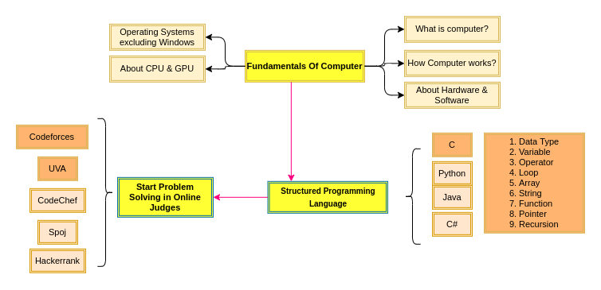
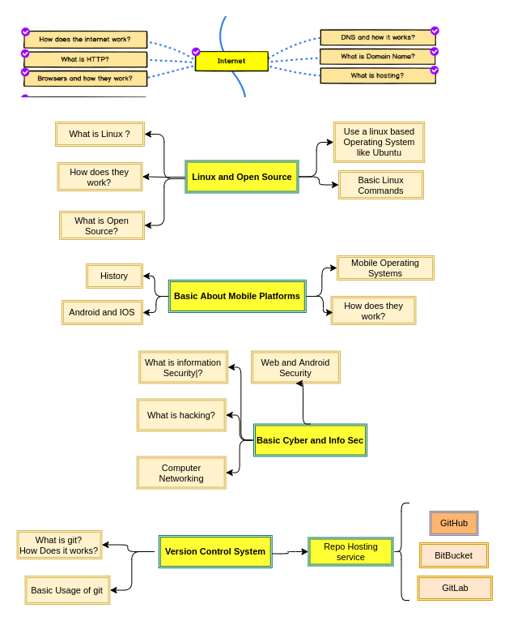
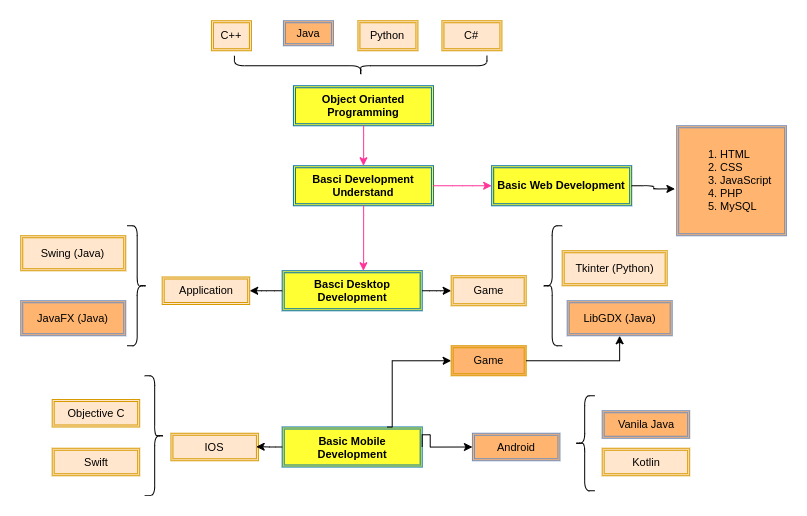
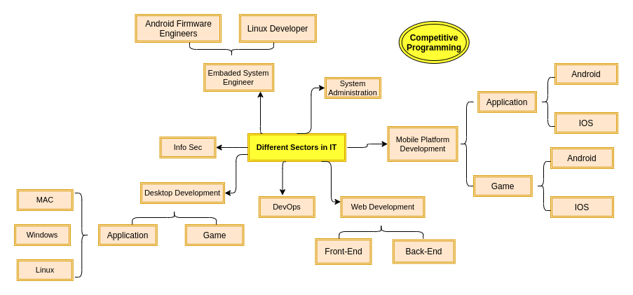
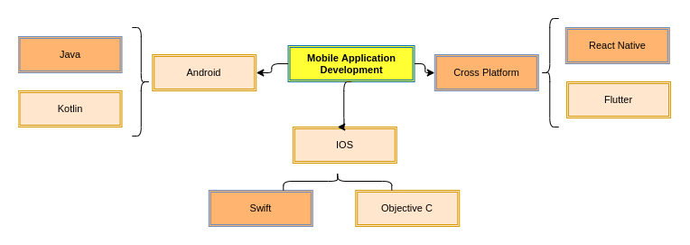
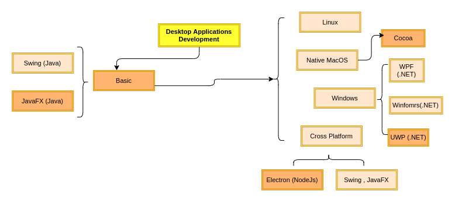
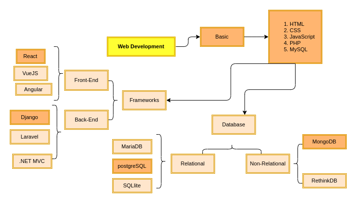
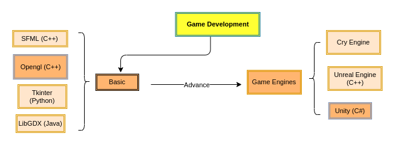
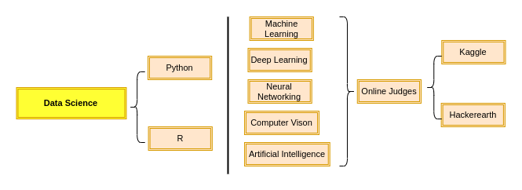
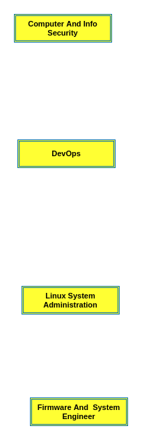

> Software Engineering Guideline,  Inspired by [web-developer-roadmap.](https://github.com/kamranahmedse/developer-roadmap)

We are studying Software Engineering or Related subjects but some of us don't know what we are studying or don't have a guideline or don't know how vast the Software Engineering or IT sector is or We just don't know which path we should choose. **Forget choosing path , even we don't know what are the options!**
So I have tried to give some informations and introduce with terminologies which are related to Software Engineering and IT and can help to know our options and choose them properly!

It's not a roadmap which you should follow and will make you GOD in IT sector. It will just show you some stuffs that can help you to choose your path! I have just use the terms and basic stuffs so that you can google them :p

**These `X year Y semester` are just for remembering that you can give `Z` months to know these things well though it can vary from person to person and I have just tried to relate these things and time with our Varsity Syllabus and curriculum !**

## First Year First Semester

First of all you have to learn about Computer,its pros and cons and basic things.

Then Learn a Programming Language.
**(If you know a language well then shifting or learning new languages will be very easy)**

**After that you can make some fun projects like game or application using that language**

- Guessing Numbers game (guess a number from 0 to 10 and match randomly) 
- Banking Management System Application (Deposite and Widrow money)
- Snake game

Some links of Popular Online Judges are :

- [Codeforces](https://codeforces.com)
- [CodeChef](https://www.codechef.com)
- [Spoj](https://www.spoj.com)
- [UVA](https://uhunt.onlinejudge.org)
- [Hackerrank](https://www.hackerrank.com)
- [Hackerearth](https://www.hackerearth.com])

## First Year Second Semester

- Learn Data Structure and Algorithms

  

* Explore stuffs :

  

- Desktop Game :

    In our curriculam we have a make a GUI (Graphical User Interface) based Game(for Desktop) using C / C++ Library like SFML ,Opengl,graphic.h

## Second Year

- Deep Drive into Competitve Programming  :
  [There is a pdf by @Shahriar(ICPC World Finalist | CSE,SUST) vai ,You can check it out.](assets/Dhaka-Regional-Raw-Syllabus-Sheet1.pdf)

  **If you like competitive programming and problem solving, then keep solving and ranking up ,take participate in contests**

- Learn Things for Software Engineering

  

## Now You have known a lot but not everything. As You have a basic knowledge a lot of sectors and probably you can Choose something to deep drive in.

## There are a lot of sectors in IT , Here are some of them :

  **And many more .....**

**Note : For IOS development, you will need a MAC!**

#### So You can choose one of them and deep drive into that or can explore more if you want!

## Here are some starting guidelines for the following sectors :

- ### Mobile Application Development:

    

    **Note:To learn more visit [Anroid](https://roadmap.sh/android)**

    

- ### Desktop Application Development:

    

- ### Web Application Development:

    

    **Note:To learn more visit [Frontend Developer](https://roadmap.sh/frontend) | [Backend Developer](https://roadmap.sh/backend)**

- ### Game Development:

    

    **Note:To learn more visit [Game-Developer-Roadmap](https://github.com/utilForever/game-developer-roadmap)**

- ### Data Science:

    
    
    
    **To learn more visit [How does a total beginner start to learn machine learning if they have some knowledge of programming languages?](https://www.quora.com/How-does-a-total-beginner-start-to-learn-machine-learning-if-they-have-some-knowledge-of-programming-languages/answer/Nisarg-Dave-17?ch=99&share=c49fec6c&srid=3l2Gx&fbclid=IwAR1x6Q3jjjSwp9vCscIevQCT74Gu9_3T4d_sPI0mySDe7wBybsajCG5d4ls)**

    **Note : The are some online judges where they arrange ML contests:**
    - [Kaggle](https://www.kaggle.com/)
    - [Hackerearth](https://www.hackerearth.com/challenges/)
 

- ### Others (to be added) :

    

  **Note:To learn more about DevOps visit [DevOps Roadmap](https://roadmap.sh/devops)**

**Note : I am not a Expert or GOD in IT sector. Just a normal geek exploring things, stuffs and want to help people who have been suffering like me ! Feel free to contribute to enrich our knowledge.**

- #### Contributions : [Main XML File for Draw.io](https://drive.google.com/file/d/1p-rENmOOQ5x_pAISXUDn3W_tE4j0R_f3/view?usp=sharing) You can edit file and export the selected part as png and add in the repo.
